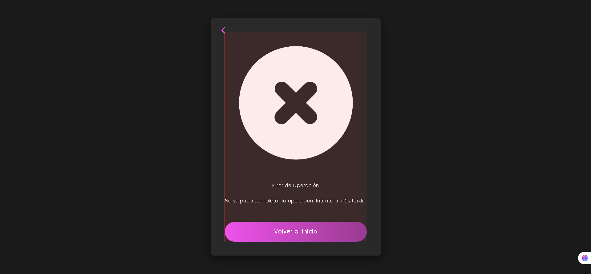

# Recuperación de Contraseña

Este módulo permite a los usuarios recuperar el acceso a su cuenta si olvidaron su contraseña.

## Solicitar Recuperación

**Endpoint:** `POST /recuperar_contrasena`

Envía un correo al usuario con un enlace de recuperación. El enlace contiene un token que expira en 1 hora o tras su primer uso.

**¿Qué hace?**

1. Verifica que el correo esté registrado  
2. Genera un token único con duración de 1 hora  
3. Envía un correo con el enlace de recuperación

**Lo que necesitas enviar:**

- `correo`: Tu correo electrónico registrado

**Respuesta exitosa:**

```json
{
  "message": "Correo de recuperación enviado"
}
```


**Como se ve en el correo**


**Posibles errores:**

- Si el correo no existe: Por segurdad se envia el mismo mensaje "Si el correo existe revisa tu bandeja de entrada"


- Si el servidor de correo falla: "No se pudo enviar el correo. Intenta más tarde"



---

## Restablecer Contraseña

**Endpoint:** `POST /auth/restablecer_contrasena`

Permite establecer una nueva contraseña usando el token recibido por correo.

**Lo que necesitas enviar:**

- `token`: El token recibido en el correo  
- `nueva_clave`: Tu nueva contraseña segura

**Respuesta exitosa:**

```json
{
  "message": "Contraseña actualizada correctamente"
}
```

**Posibles errores:**

- Token inválido o expirado: "El token no es válido o ha expirado"
- Contraseña débil: "La nueva contraseña no cumple con los requisitos de seguridad"

---

## Notas de Seguridad

- **Expiración del token:** El token expira automáticamente en 1 hora o tras su primer uso  
- **Protección de enlaces:** Cada enlace es único y no reutilizable  
- **Validación de contraseña:** Se recomienda usar al menos 8 caracteres, una mayúscula, un número y un símbolo


   :width: 400px