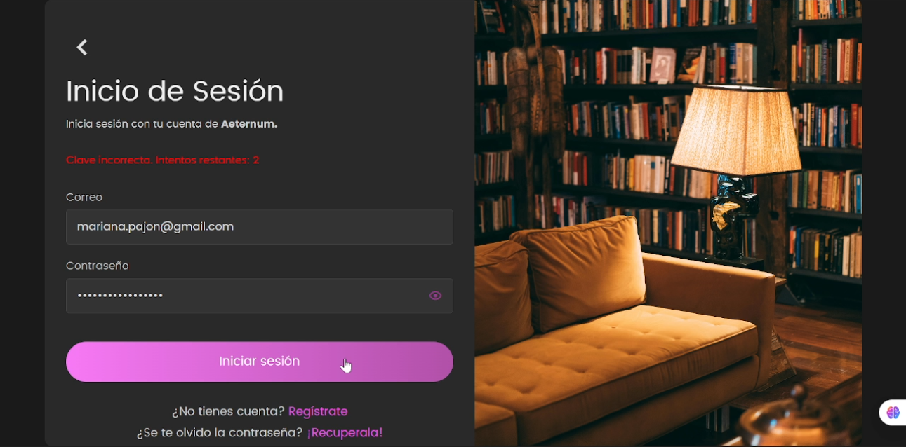

============================
Autenticación de Usuarios
============================

Este módulo maneja todo lo relacionado con el registro y login de usuarios en Aeternum.

.. note::
   
   Aeternum utiliza **JWT (JSON Web Tokens)** para autenticación segura y **bcrypt** para encriptación de contraseñas.

----

Iniciar Sesión
==================

**Endpoint:** ``POST /auth/login``

.. raw:: html

   

     

       POST
       <code>/auth/login</code>
     

     
Permite a los usuarios iniciar sesión en el sistema usando su correo y contraseña.

   

¿Qué hace?
-----------

1. Verifica que el correo esté registrado en el sistema
2. Comprueba que la contraseña sea correcta (bcrypt)
3. Si todo está bien, genera un **token JWT** para acceder al sistema
4. Si fallas **3 veces seguidas**, bloquea tu cuenta por **15 minutos** (protección contra fuerza bruta)

.. image:: _static/login.png
   :alt: Pantalla de inicio de sesión
   :align: center
   :width: 500px

Datos a Enviar
---------------

.. code-block:: json

   {
     "correo": "usuario@ejemplo.com",
     "clave": "miContraseña123"
   }

**Campos:**

- ``correo`` (string, requerido): Tu correo electrónico registrado  
- ``clave`` (string, requerido): Tu contraseña

Respuesta Exitosa
------------------

.. code-block:: json

   {
     "access_token": "eyJhbGciOiJIUzI1NiIsInR5cCI6IkpXVCJ9...",
     "token_type": "bearer",
     "rol": "usuario"
   }

**Campos de respuesta:**

- ``access_token``: Token JWT para autenticación (válido por 24 horas)
- ``token_type``: Siempre "bearer"
- ``rol``: Rol del usuario ("usuario" o "bibliotecario")

.. tip::
   
   Guarda el ``access_token`` de forma segura. Deberás incluirlo en el header ``Authorization: Bearer {token}`` para todas las peticiones autenticadas.

Posibles Errores
-----------------

**Correo no registrado:**

.. code-block:: json

   {
     "detail": "El correo no está registrado"
   }

.. image:: _static/correo_no_existe_login.png
   :alt: Error: correo no registrado
   :align: center
   :width: 450px

**Contraseña incorrecta:**

.. code-block:: json

   {
     "detail": "Clave incorrecta. Intentos restantes: 2"
   }

**Cuenta bloqueada:**

.. code-block:: json

   {
     "detail": "Cuenta bloqueada temporalmente. Intenta en 15 minutos"
   }

.. image:: _static/cuenta_bloqueda_login.png
   :alt: Error: cuenta bloqueada
   :align: center
   :width: 450px

----

Registrar Nueva Cuenta
===========================

**Endpoint:** ``POST /auth/register``

.. raw:: html

   

     

       POST
       <code>/auth/register</code>
     

     
Crea una nueva cuenta de usuario en Aeternum.

   

¿Qué hace?
-----------

1. Verifica que el **correo** no esté usado por otra persona  
2. Verifica que el **número de identificación** sea único  
3. Encripta tu contraseña con **bcrypt** (nadie puede verla, ni nosotros)  
4. Guarda tu aceptación de la **política de privacidad**  
5. Crea tu cuenta con rol "usuario" por defecto
6. Registra metadata (IP, navegador, fecha) para cumplir GDPR

.. image:: _static/registro.png
   :alt: Formulario de registro
   :align: center
   :width: 500px

Datos a Enviar
---------------

.. code-block:: json

   {
     "nombre": "Juan",
     "apellido": "Pérez",
     "tipo_identificacion": "CC",
     "num_identificacion": "1234567890",
     "correo": "juan@ejemplo.com",
     "clave": "MiContraseña123!",
     "rol": "usuario",
     "consent": true
   }

**Campos:**

- ``nombre`` (string, requerido): Tu nombre  
- ``apellido`` (string, requerido): Tu apellido  
- ``tipo_identificacion`` (string, requerido): Tipo de documento
  
  - Valores válidos: ``CC``, ``TI``, ``CE``, ``PA``

- ``num_identificacion`` (string, requerido): Número de tu documento  
- ``correo`` (string, requerido): Tu correo electrónico (debe ser único)  
- ``clave`` (string, requerido): Una contraseña segura
  
  - Mínimo 8 caracteres
  - Al menos 1 mayúscula, 1 minúscula, 1 número

- ``rol`` (string, opcional): Rol que tendrás (default: "usuario")
- ``consent`` (boolean, requerido): Debe ser ``true`` (aceptar política de privacidad)

Respuesta Exitosa
------------------

.. code-block:: json

   {
     "message": "¡Cuenta creada con éxito!",
     "user_id": 42
   }

.. tip::
   
   Después de registrarte, usa el endpoint de **login** para obtener tu token y empezar a usar Aeternum.

Posibles Errores
-----------------

**Falta consentimiento:**

.. code-block:: json

   {
     "detail": "Debes aceptar la Política de Privacidad para continuar"
   }

.. image:: _static/consent_required.png
   :alt: Error: consentimiento requerido
   :align: center
   :width: 450px

**Correo ya registrado:**

.. code-block:: json

   {
     "detail": "El correo ya está registrado"
   }

.. image:: _static/correo_registrado.jpeg
   :alt: Error: correo ya existe
   :align: center
   :width: 450px

**Documento ya registrado:**

.. code-block:: json

   {
     "detail": "El número de identificación ya está registrado"
   }

.. image:: _static/numero_identificacion_registrado.jpeg
   :alt: Error: documento ya existe
   :align: center
   :width: 450px

**Contraseña débil:**

.. code-block:: json

   {
     "detail": "La contraseña debe tener al menos 8 caracteres, una mayúscula y un número"
   }

----

Notas de Seguridad
======================

.. warning::
   
   **Protecciones implementadas:**

**1. Encriptación de Contraseñas**

Todas las contraseñas se encriptan usando **bcrypt** con factor de costo 12. Esto significa:

- Nadie puede ver tu contraseña real (ni administradores)
- Es computacionalmente costoso para atacantes hacer fuerza bruta
- Cada contraseña tiene un "salt" único

**2. Protección contra Fuerza Bruta**

Sistema de bloqueo progresivo:

- **Intento 1-2**: Permite intentar
- **Intento 3**: Bloquea la cuenta por **15 minutos**
- Usa **Redis** para rastrear intentos en tiempo real
- El contador se resetea tras login exitoso

**3. Registro de Consentimiento (GDPR)**

Cumplimos con leyes de protección de datos guardando:

- Fecha y hora de aceptación
- Dirección IP del registro
- User-Agent (navegador usado)
- Versión de la política aceptada

**4. Tokens JWT**

- Expiración: **24 horas**
- Firmados con clave secreta
- Incluyen: ``user_id``, ``correo``, ``rol``
- No almacenan información sensible

**5. Validación de Datos**

- Correos deben ser válidos (formato email)
- Contraseñas deben cumplir requisitos mínimos
- Documentos deben ser únicos
- Sanitización de inputs para prevenir SQL Injection

----

Mejores Prácticas
=======================

Para Usuarios
--------------

.. tip::
   
   - **Usa contraseñas únicas**: No reutilices contraseñas de otros sitios
   - **No compartas tu token**: Trátalo como tu contraseña
   - **Cierra sesión**: Especialmente en dispositivos compartidos
   - **Actualiza tu contraseña**: Cada 3-6 meses

Para Desarrolladores
---------------------

.. code-block:: javascript

   // ✓ CORRECTO: Guardar token de forma segura
   localStorage.setItem('token', response.access_token);
   
   // ✓ CORRECTO: Incluir en headers
   headers: {
     'Authorization': `Bearer ${token}`
   }
   
   // ✗ INCORRECTO: Nunca guardes contraseñas
   // localStorage.setItem('password', password);

.. note::
   
   El token debe incluirse en todas las peticiones a endpoints protegidos usando el header ``Authorization``.