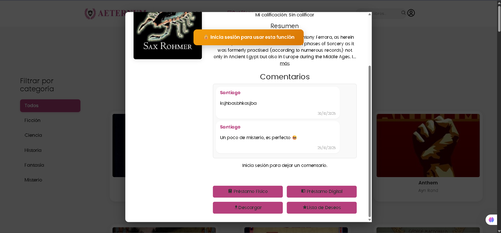

Usuarios
==========================

Este módulo maneja todo lo relacionado con el usuario en Aeternum.

Inicio
--------------

**Endpoint:** ``GET /user/me``  
Permite a los usuarios ver un inicio con unos libros y su nombre.

**¿Qué hace?**

1. Se autentica el usuario con el token
2. Muestra el nombre del usuario
3. Muestra libros recomendados
4. Se pueden acceder a ellos y ver detalles y funciones

.. image:: _static/dashboard_user.png
   :alt: Ejemplo de pantalla de login
   :align: center
   :width: 400px

Catalogo
------------------

- En el catálogo se pueden ver todos los libros disponibles en la plataforma.
- Se pueden filtrar por categorías y buscar por nombre o autor.

.. image:: _static/catalogo_logueado.png
   :alt: Error: correo no registrado
   :align: center
   :width: 400px

Modal Libro
------------------

- Al dar clic en un libro (recomendado o catálogo), se abre un modal con la información del libro y sus funciones.
- Si no ha iniciado sesión, aparecerá un mensaje indicando que necesita autenticarse.

Funciones del Libro
-----------------------

- Préstamos físicos y digitales.  
- Si está disponible, se puede solicitar; si no, se muestra mensaje correspondiente.
- Lista de deseos.
- Opción de descarga.

.. image:: _static/modal_logueado.png
   :alt: Error: clave incorrecta
   :align: center
   :width: 400px

Préstamo Digital
^^^^^^^^^^^^^^^^^^^^^^

- Al dar clic, redirige a una página para leer el libro en línea.

Préstamo Físico
^^^^^^^^^^^^^^^^^^^^^^

- Se abre un modal para seleccionar fecha de recogida y confirmar.
- Se dan **12 días** para leer el libro.
- Se envía correo al confirmar préstamo.

.. image:: _static/prestamo_fisico.png
   :alt: Error: clave incorrecta
   :align: center
   :width: 400px

.. image:: _static/correo_prestamo_fisico.png
   :alt: Error: clave incorrecta
   :align: center
   :width: 400px

Lista de Deseos
^^^^^^^^^^^^^^^^^^^^^^

- Se pueden agregar o quitar libros.
- Se accede desde el menú en "Lista de deseos".

.. image:: _static/guarda_lista_deseos.png
   :alt: Error: clave incorrecta
   :align: center
   :width: 400px

.. image:: _static/lista_deseos.png
   :alt: Error: clave incorrecta
   :align: center
   :width: 400px

Descargas
^^^^^^^^^^^^^^^^^^^^^^

- Si el libro tiene descarga habilitada, redirige a la página de lectura/descarga.
- Si no, redirige a la página del préstamo digital.

Perfil del Usuario
----------------------

- Ver información de la cuenta.
- Editar perfil.
- Eliminar cuenta.

.. image:: _static/mi_perfil.png
   :alt: Cuenta bloqueada
   :align: center
   :width: 400px

Préstamos Físicos (Vista)
-----------------------------

- Ver préstamos activos, estado y fecha de devolución.
- Posibilidad de cancelar un préstamo activo.

.. image:: _static/mis_prestamos.png
   :alt: Cuenta bloqueada
   :align: center
   :width: 400px

Notas de Seguridad
----------------------

**Eliminar Cuenta:**  
La cuenta se elimina de forma segura del sistema.
